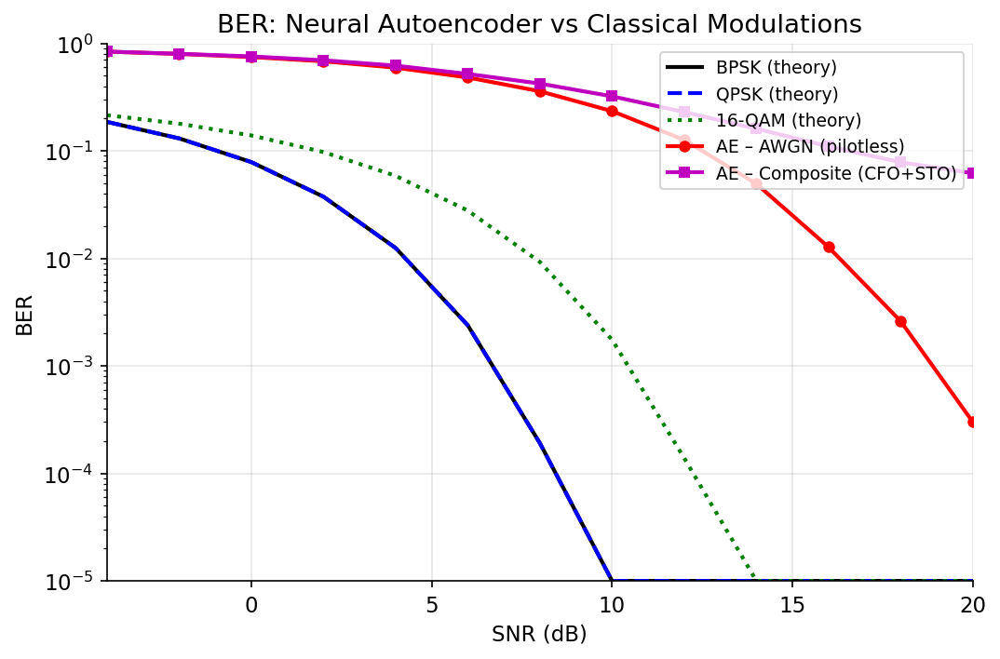
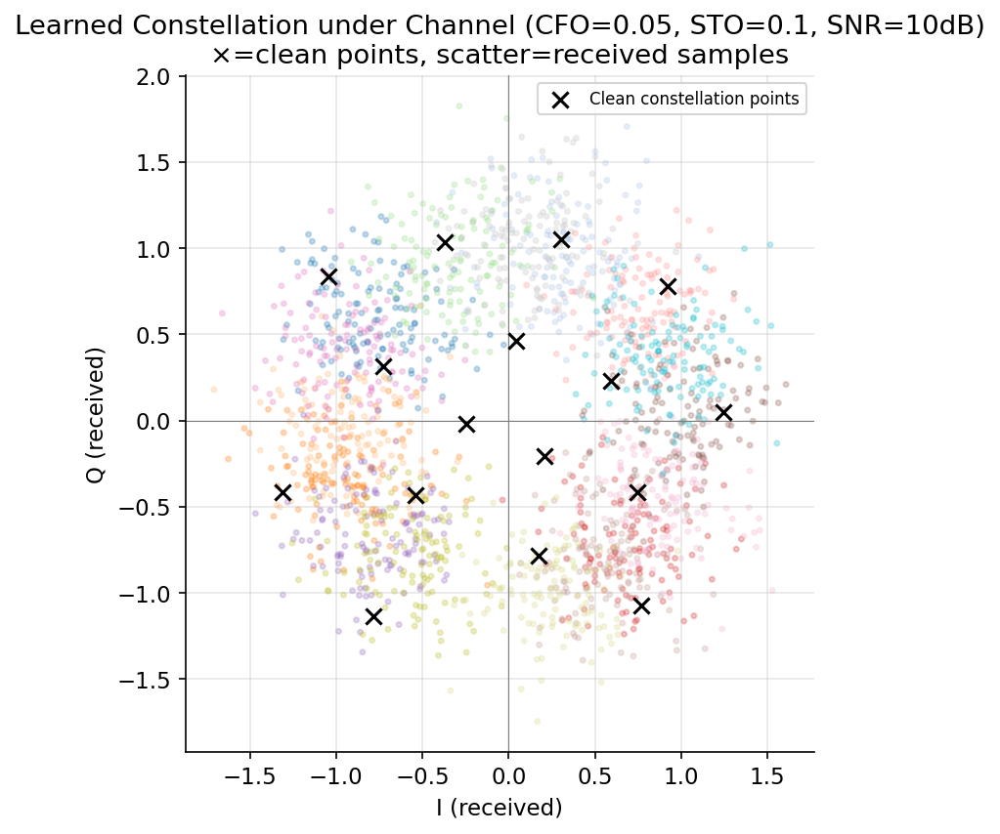
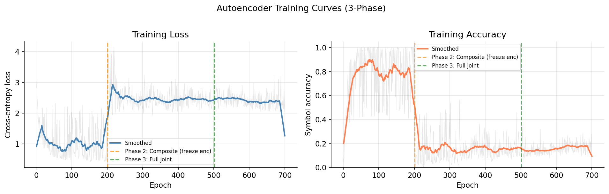
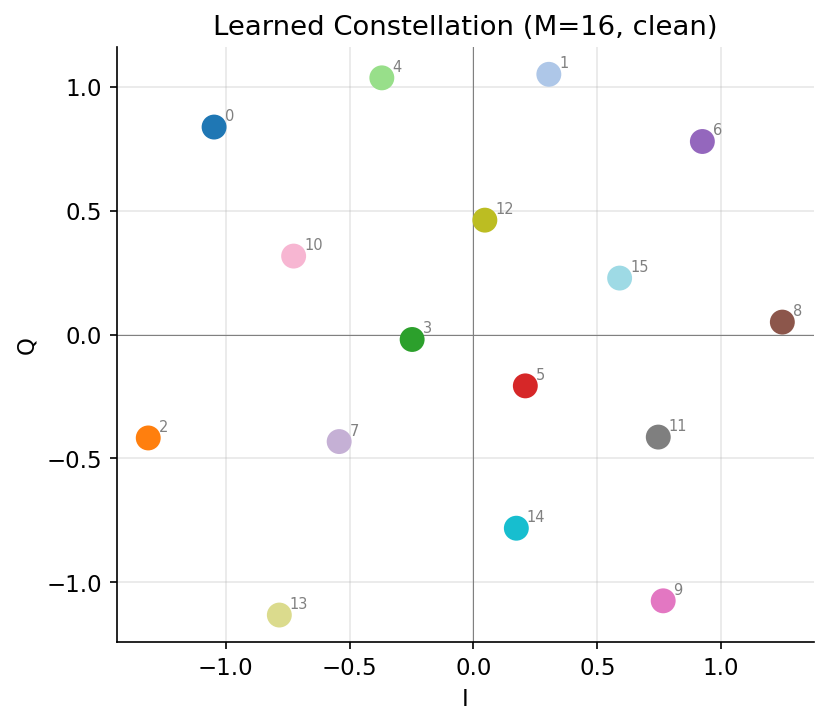

# Blind Synchronization for Pilotless Neural Transceivers

End-to-end deep learning based wireless communication system that performs **blind synchronization (CFO + STO) without pilots or prior channel knowledge**.

--

## 📌 Overview

Classical communication systems rely on:

* Pilot symbols
* Explicit synchronization algorithms (Costas loop, Gardner timing, etc.)

This project removes both.

We propose a **fully learned neural transceiver** that:

* Learns modulation (encoder)
* Learns synchronization (SEM module)
* Learns decoding (classifier)

All **jointly and end-to-end**.

---

## 🚀 Key Contributions

* ✅ **Pilotless communication**
* ✅ **Blind synchronization (CFO + STO)**
* ✅ **No known channel model**
* ✅ **Sync Estimation Module (SEM)** using neural networks
* ✅ **Curriculum training to stabilize learning**
* ✅ **Evaluation under real-world impairments**

---

## 🧠 System Architecture

```
Message → Encoder NN → Channel (CFO + STO + Noise)
        → Sync Estimation Module (SEM)
        → Decoder NN → Output
```

### Channel Impairments

* AWGN
* CFO (Carrier Frequency Offset)
* STO (Symbol Timing Offset)
* Impulsive Noise
* Colored Noise
* (Test-time) Rayleigh Fading, Doppler

---

## 🔍 Blind Synchronization (Core Idea)

Instead of:

* estimating CFO/STO explicitly
* or using pilot symbols

We train the model under **random impairments per batch**:

* CFO ~ Uniform distribution
* STO ~ Random shifts
* SNR ~ Randomized

👉 The network learns to decode correctly across all distortions
👉 Synchronization emerges **implicitly**

---

## 🧩 Sync Estimation Module (SEM)

A lightweight neural module that performs:

1. **Amplitude normalization** (STO proxy)
2. **Phase rotation correction** (CFO proxy)

Implemented using two small MLPs:

* One predicts amplitude scaling
* One predicts phase rotation

Fully differentiable and trained end-to-end.

---

## 🎓 Training Strategy (Critical)

Naive training fails due to instability.

We use a **3-phase curriculum**:

### Phase 1 — AWGN only

* Learn stable constellation

### Phase 2 — CFO + STO (encoder frozen)

* SEM learns synchronization

### Phase 3 — Joint fine-tuning

* Full system adapts together

---

## 📊 Results

### BER Performance

| System            | BER @ 10 dB |
| ----------------- | ----------- |
| AE (AWGN)         | 0.22        |
| AE (CFO + STO)    | 0.30        |
| Impulsive Noise   | 0.27        |
| Doppler           | 0.25        |
| Rayleigh (unseen) | 0.89        |

---

### 📉 BER Curve



---

### 🎯 Learned Constellation



---

### 📈 Training Curve



---

## ⚖️ Key Insight

✔ Classical systems → near-zero BER but require pilots
✔ Our system → higher BER but **zero pilot overhead**

👉 Tradeoff: **spectral efficiency vs reliability**

---

## ⚙️ Complexity

* Parameters: **183,831**
* FLOPs: **~360K per symbol**
* Pilot overhead: **0%**

---

## 🚀 How to Run

### Install dependencies

```bash
pip install -r requirements.txt
```

### Run full pipeline

```bash
python main.py
```

---

## 📁 Project Structure

```
models/        → encoder + decoder  
channel/       → channel impairments  
training/      → training loop  
utils/         → plotting + evaluation  
baseline/      → classical communication comparison  
results/       → plots + reports  
```

---

## 📄 Conference Paper

**Blind Synchronization for Pilotless Neural Transceivers**

📥 [Read the Full Paper (PDF)](paper/Blind_Synchronization_Paper.pdf)

Authors:

* Aby Joseph
* Naina Modi

---
## 📊 Paper Highlights

### System Architecture


### BER Performance


---

## ❗ Limitations (Honest)

* High BER compared to classical systems
* Fails under unseen Rayleigh fading
* No channel coding (no error correction)

---

## 🔮 Future Work

* Train under Rayleigh fading
* Add LDPC / Polar coding
* Sequence-based synchronization (RNN / Transformer)
* SDR / real-time deployment

---

## 🔬 Keywords

Wireless Communications · Deep Learning · Autoencoder · Synchronization · CFO · STO · Signal Processing

---
